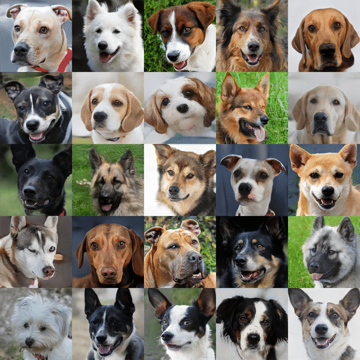
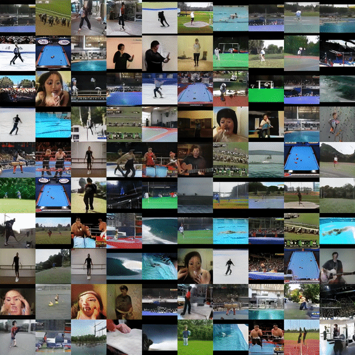
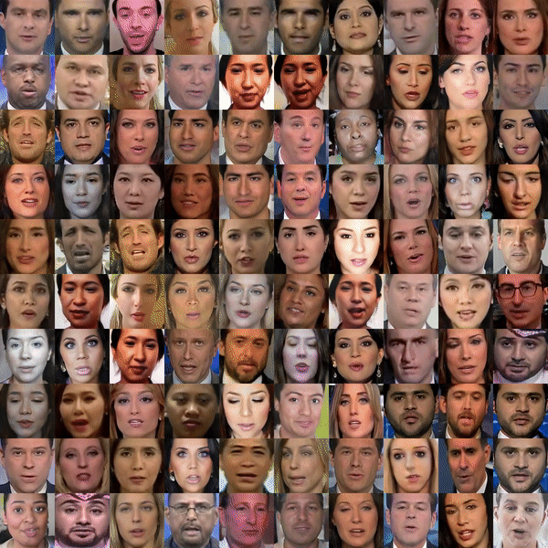
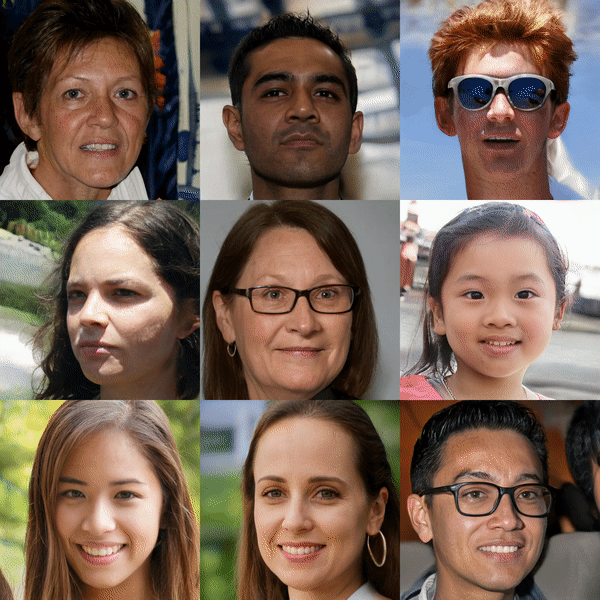
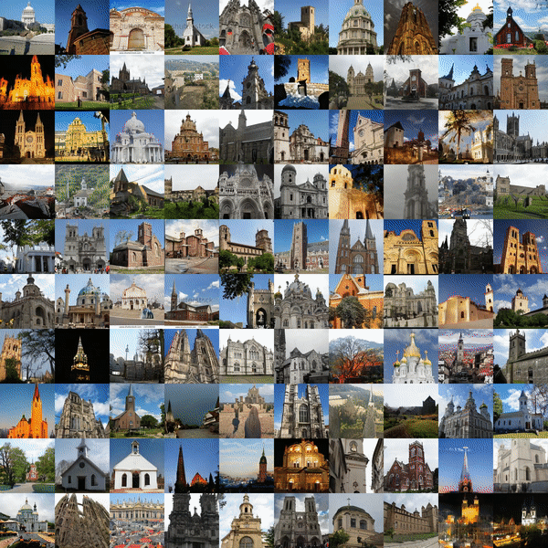

# MoCoGAN-HD
### [Project](https://bluer555.github.io/MoCoGAN-HD/) | [OpenReview](https://openreview.net/forum?id=6puCSjH3hwA) | [arXiv](https://arxiv.org/abs/2104.15069) | [Talk](https://papertalk.org/papertalks/29015) | [Slides](https://iclr.cc/media/Slides/iclr/2021/virtual(03-08-00)-03-08-00UTC-2810-a_good_image.pdf)

### (AFHQ, VoxCeleb)


Pytorch implementation of our method for high-resolution (e.g. 1024x1024) and cross-domain video synthesis. <br>
[A Good Image Generator Is What You Need for High-Resolution Video Synthesis]()  
[Yu Tian](https://scholar.google.com/citations?user=DxPjkDoAAAAJ&hl=en)<sup>1</sup>, [Jian Ren](https://alanspike.github.io/)<sup>2</sup>, [Menglei Chai](https://mlchai.com/)<sup>2</sup>, [Kyle Olszewski](https://kyleolsz.github.io/)<sup>2</sup>, [Xi Peng](https://sites.google.com/site/xipengcshomepage/home)<sup>3</sup>, [Dimitris N. Metaxas](https://www.cs.rutgers.edu/~dnm/)<sup>1</sup>, [Sergey Tulyakov](http://www.stulyakov.com/)<sup>2</sup>  
<sup>1</sup>Rutgers Univeristy, <sup>2</sup>Snap Inc., <sup>3</sup>University of Delaware <br>
In ICLR 2021, Spotlight.  
 

## Pre-trained Image Generator & Video Datasets

### In-domain Video Synthesis
UCF-101: [image generator](https://drive.google.com/file/d/1USJutDCXOxxEqgOKEzuov7tbHu6iVKdz/view?usp=sharing), [video data](https://www.crcv.ucf.edu/data/UCF101.php), [motion generator](https://drive.google.com/drive/u/2/folders/1rWFgh_Qzw_P33kRr6bIVcNm-KHQotlsC) <br>
FaceForensics: [image generator](https://drive.google.com/file/d/1q8K5VCO3e-WTmC2YrI_z3Nqwf2j4BXXa/view?usp=sharing), [video data](https://github.com/ondyari/FaceForensics), [motion generator](https://drive.google.com/drive/folders/1h5Mpcj-ryMqc7m5DVGs40CPoFQKfELP1?usp=sharing) <br>
Sky-Timelapse: [image generator](https://drive.google.com/file/d/16qHqShQMAdftVQen9kGBMIUeSh5kQr9d/view?usp=sharing), [video data](https://github.com/weixiong-ur/mdgan)
### Cross-domain Video Synthesis
(FFHQ, VoxCeleb): [FFHQ image generator](https://drive.google.com/file/d/1Mw0HvFimDpdHjV1bX_VQXDxIfVKpmqC_/view?usp=sharing), [VoxCeleb](https://www.robots.ox.ac.uk/~vgg/data/voxceleb/vox1.html) <br>
(AFHQ, VoxCeleb): [AFHQ image generator](https://drive.google.com/file/d/1dx5z0rp3UGyjLTWpf8P69DJy8JS9IPkE/view?usp=sharing), [VoxCeleb](https://www.robots.ox.ac.uk/~vgg/data/voxceleb/vox1.html), [motion generator](https://drive.google.com/drive/folders/17hnIg_KeuwK5gUSYa1sfrJAnXbOonUbO?usp=sharing) <br>
(Anime, VoxCeleb): [Anime image generator](https://drive.google.com/file/d/1kd73588GaF1242_WPHQuIwQo2eFJQKwH/view?usp=sharing), [VoxCeleb](https://www.robots.ox.ac.uk/~vgg/data/voxceleb/vox1.html), [motion generator](https://drive.google.com/drive/folders/1X5jIUItBtsbkFDcL-gP0bby2JrG0xAZW?usp=sharing) <br>
(FFHQ-1024, VoxCeleb): [FFHQ-1024 image generator](https://drive.google.com/file/d/1oljdihTnT53CbHrjAe2BMcbueNjH67Gd/view?usp=sharing), [VoxCeleb](https://www.robots.ox.ac.uk/~vgg/data/voxceleb/vox1.html) <br>
(LSUN-Church, TLVDB): [LSUN-Church image generator](https://drive.google.com/file/d/1Vk3MEzsAl88cfpztKI2hc6jSTR41tTTw/view?usp=sharing), [TLVDB](http://people.csail.mit.edu/yichangshih/time_lapse/)

Calculated pca stats are saved [here](https://drive.google.com/drive/folders/1zfowC7njgeWeb97eWMVE0VrfUaUHYrK-?usp=sharing).

## Training
Organise the video dataset as follows:
```
Video dataset
|-- video1
    |-- img_0000.png
    |-- img_0001.png
    |-- img_0002.png
    |-- ...
|-- video2
    |-- img_0000.png
    |-- img_0001.png
    |-- img_0002.png
    |-- ...
|-- video3
    |-- img_0000.png
    |-- img_0001.png
    |-- img_0002.png
    |-- ...
|-- ...
```
### In-domain Video Synthesis
#### UCF-101
Collect the PCA components from a pre-trained image generator.
```
python get_stats_pca.py --batchSize 4000 \
  --save_pca_path pca_stats/ucf_101 \
  --pca_iterations 250 \
  --latent_dimension 512 \
  --img_g_weights /path/to/ucf_101_image_generator \
  --style_gan_size 256 \
  --gpu 0
```
Train the model
```
python -W ignore train.py --name ucf_101 \
  --time_step 2 \
  --lr 0.0001 \
  --save_pca_path pca_stats/ucf_101 \
  --latent_dimension 512 \
  --dataroot /path/to/ucf_101 \
  --checkpoints_dir checkpoints/ucf_101 \
  --img_g_weights /path/to/ucf_101_image_generator \
  --multiprocessing_distributed --world_size 1 --rank 0 \
  --batchSize 16 \
  --workers 8 \
  --style_gan_size 256 \
  --total_epoch 100 \
```
Inference
```
python -W ignore evaluate.py  \
  --save_pca_path pca_stats/ucf_101 \
  --latent_dimension 512 \
  --style_gan_size 256 \
  --img_g_weights /path/to/ucf_101_image_generator \
  --load_pretrain_path /path/to/checkpoints \
  --load_pretrain_epoch the_epoch_for_testing (should >= 0) \
  --results results/ucf_101 \
  --num_test_videos 10 \
```
#### FaceForensics
Collect the PCA components from a pre-trained image generator.
```
sh script/faceforensics/run_get_stats_pca.sh
```
Train the model
```
sh script/faceforensics/run_train.sh
```
Inference
```
sh script/faceforensics/run_evaluate.sh
```
#### Sky-Timelapse
Collect the PCA components from a pre-trained image generator.
```
sh script/sky_timelapse/run_get_stats_pca.sh
```
Train the model
```
sh script/sky_timelapse/run_train.sh
```
Inference
```
sh script/sky_timelapse/run_evaluate.sh
```

### Cross-domain Video Synthesis
#### (FFHQ, VoxCeleb)
Collect the PCA components from a pre-trained image generator.
```
python get_stats_pca.py --batchSize 4000 \
  --save_pca_path pca_stats/ffhq_256 \
  --pca_iterations 250 \
  --latent_dimension 512 \
  --img_g_weights /path/to/ffhq_image_generator \
  --style_gan_size 256 \
  --gpu 0
```
Train the model
```
python -W ignore train.py --name ffhq_256-voxel \
  --time_step 2 \
  --lr 0.0001 \
  --save_pca_path pca_stats/ffhq_256 \
  --latent_dimension 512 \
  --dataroot /path/to/voxel_dataset \
  --checkpoints_dir checkpoints \
  --img_g_weights /path/to/ffhq_image_generator \
  --multiprocessing_distributed --world_size 1 --rank 0 \
  --batchSize 16 \
  --workers 8 \
  --style_gan_size 256 \
  --total_epoch 25 \
  --cross_domain \
```
Inference
```
python -W ignore evaluate.py  \
  --save_pca_path pca_stats/ffhq_256 \
  --latent_dimension 512 \
  --style_gan_size 256 \
  --img_g_weights /path/to/ffhq_image_generator \
  --load_pretrain_path /path/to/checkpoints \
  --load_pretrain_epoch the_epoch_for_testing (should >= 0) \
  --results results/ffhq_256 \
  --num_test_videos 10 \
```
#### (FFHQ-1024, VoxCeleb)
Collect the PCA components from a pre-trained image generator.
```
sh script/ffhq_1024-vox/run_get_stats_pca.sh
```
Train the model
```
sh script/ffhq_1024-vox/run_train.sh
```
Inference
```
sh script/ffhq_1024-vox/run_evaluate.sh
```
#### (AFHQ, VoxCeleb)
Collect the PCA components from a pre-trained image generator.
```
sh script/afhq-vox/run_get_stats_pca.sh
```
Train the model
```
sh script/afhq-vox/run_train.sh
```
Inference
```
sh script/afhq-vox/run_evaluate.sh
```
#### (Anime, VoxCeleb)
Collect the PCA components from a pre-trained image generator.
```
sh script/anime-vox/run_get_stats_pca.sh
```
Train the model
```
sh script/anime-vox/run_train.sh
```
Inference
```
sh script/anime-vox/run_evaluate.sh
```
#### (LSUN-Church, TLVDB)
Collect the PCA components from a pre-trained image generator.
```
sh script/lsun_church-tlvdb/run_get_stats_pca.sh
```
Train the model
```
sh script/lsun_church-tlvdb/run_train.sh
```
Inference
```
sh script/lsun_church-tlvdb/run_evaluate.sh
```
## Fine-tuning
If you wish to resume interupted training or fine-tune a pre-trained model, run (use UCF-101 as an example):
```
python -W ignore train.py --name ucf_101 \
  --time_step 2 \
  --lr 0.0001 \
  --save_pca_path pca_stats/ucf_101 \
  --latent_dimension 512 \
  --dataroot /path/to/ucf_101 \
  --checkpoints_dir checkpoints \
  --img_g_weights /path/to/ucf_101_image_generator \
  --multiprocessing_distributed --world_size 1 --rank 0 \
  --batchSize 16 \
  --workers 8 \
  --style_gan_size 256 \
  --total_epoch 100 \
  --load_pretrain_path /path/to/checkpoints \
  --load_pretrain_epoch 0
```
## Training Control With Options
```--w_residual``` controls the step of motion residual, default value is 0.2, we recommand <= 0.5 <br>
```--n_pca``` # of PCA basis, used in the motion residual calculation, default value is 384 (out of 512 dim of StyleGAN2 w space), we recommand >= 256 <br>
```--q_len``` size of queue to save logits used in constrastive loss, default value is 4,096 <br>
```--video_frame_size``` spatial size of video frames for training, all synthesized video clips will be down-sampled to this size before feeding to the video discriminator, default value is 128, larger size may lead to better motion modeling <br>
```--cross_domain``` activate for cross-domain video synthesis, default value is False <br>
```--w_match``` weight for feature matching loss, default value is 1.0, large value improves content matching <br>

## Long Sequence Generation
### LSTM Unrolling
In inference, you can generate long sequence by LSTM unrolling with ```--n_frames_G``` 
```
python -W ignore evaluate.py  \
  --save_pca_path pca_stats/ffhq_256 \
  --latent_dimension 512 \
  --style_gan_size 256 \
  --img_g_weights /path/to/ffhq_image_generator \
  --load_pretrain_path /path/to/checkpoints \
  --load_pretrain_epoch 0 \
  --n_frames_G 32
```
### Interpolation
In inference, you can generate long sequence by interpolation with ```--interpolation``` 
```
python -W ignore evaluate.py  \
  --save_pca_path pca_stats/ffhq_256 \
  --latent_dimension 512 \
  --style_gan_size 256 \
  --img_g_weights /path/to/ffhq_image_generator \
  --load_pretrain_path /path/to/checkpoints \
  --load_pretrain_epoch 0 \
  --interpolation
```

## Examples of Generated Videos
### UCF-101

### FaceForensics

### Sky Timelapse

### (FFHQ, VoxCeleb)

### (FFHQ-1024, VoxCeleb)

### (Anime, VoxCeleb)

### (LSUN-Church, TLVDB)



### Citation
If you use the code for your work, please cite our paper.
```
@inproceedings{
tian2021a,
title={A Good Image Generator Is What You Need for High-Resolution Video Synthesis},
author={Yu Tian and Jian Ren and Menglei Chai and Kyle Olszewski and Xi Peng and Dimitris N. Metaxas and Sergey Tulyakov},
booktitle={International Conference on Learning Representations},
year={2021},
url={https://openreview.net/forum?id=6puCSjH3hwA}
}
```

## Acknowledgments
This code borrows [StyleGAN2 Image Generator](https://github.com/rosinality/stylegan2-pytorch), [BigGAN Discriminator](https://github.com/ajbrock/BigGAN-PyTorch), [PatchGAN Discriminator](https://github.com/NVIDIA/pix2pixHD).
